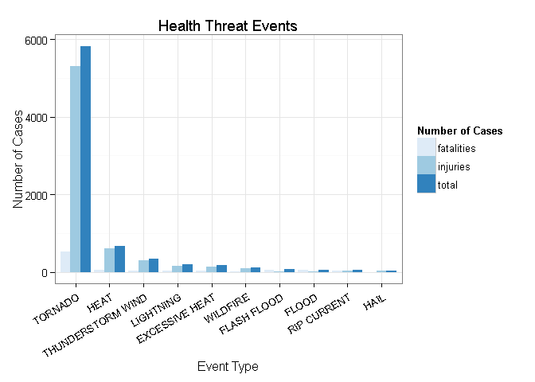
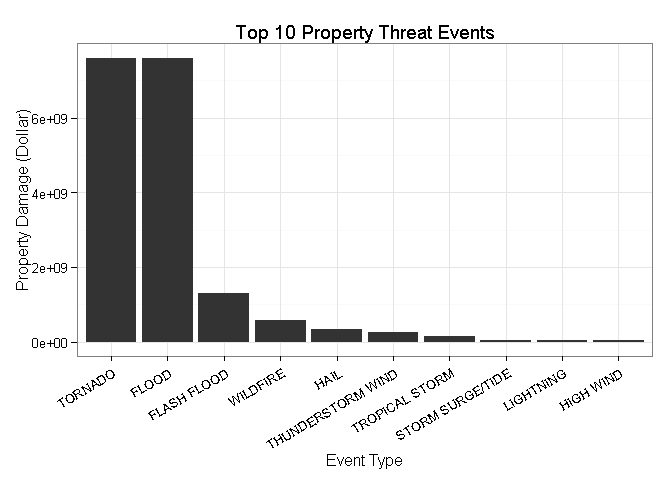
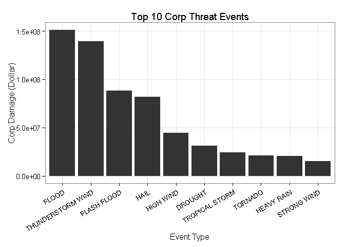

National Oceanic and Atmospheric Administration's Storm Database Analysis
===============

### Sysnopsis
The U.S. National Oceanic and Atmospheric Administration's (**NOAA**) storm database was used to compare outcomes from storm and severe weather event categories. Analyzed data are from 1993--2011. Outcomes analyzed are the number of fatalities and injuries and the dollar amount of property damage. Event categories are convective, extreme temperature, flood, winter, and other.

Estimates of fatalities, injuries, property and crop damage were used to provide assistance with which types of event are most harmful to the population health and what the economic impact might be.

### Read and Processing Data
- Read data

```r
data1 <- read.csv(bzfile("StormData.csv.bz2"))
str(data1)
```

```
## 'data.frame':	902297 obs. of  37 variables:
##  $ STATE__   : num  1 1 1 1 1 1 1 1 1 1 ...
##  $ BGN_DATE  : Factor w/ 16335 levels "1/1/1966 0:00:00",..: 6523 6523 4242 11116 2224 2224 2260 383 3980 3980 ...
##  $ BGN_TIME  : Factor w/ 3608 levels "00:00:00 AM",..: 272 287 2705 1683 2584 3186 242 1683 3186 3186 ...
##  $ TIME_ZONE : Factor w/ 22 levels "ADT","AKS","AST",..: 7 7 7 7 7 7 7 7 7 7 ...
##  $ COUNTY    : num  97 3 57 89 43 77 9 123 125 57 ...
##  $ COUNTYNAME: Factor w/ 29601 levels "","5NM E OF MACKINAC BRIDGE TO PRESQUE ISLE LT MI",..: 13513 1873 4598 10592 4372 10094 1973 23873 24418 4598 ...
##  $ STATE     : Factor w/ 72 levels "AK","AL","AM",..: 2 2 2 2 2 2 2 2 2 2 ...
##  $ EVTYPE    : Factor w/ 985 levels "   HIGH SURF ADVISORY",..: 834 834 834 834 834 834 834 834 834 834 ...
##  $ BGN_RANGE : num  0 0 0 0 0 0 0 0 0 0 ...
##  $ BGN_AZI   : Factor w/ 35 levels "","  N"," NW",..: 1 1 1 1 1 1 1 1 1 1 ...
##  $ BGN_LOCATI: Factor w/ 54429 levels "","- 1 N Albion",..: 1 1 1 1 1 1 1 1 1 1 ...
##  $ END_DATE  : Factor w/ 6663 levels "","1/1/1993 0:00:00",..: 1 1 1 1 1 1 1 1 1 1 ...
##  $ END_TIME  : Factor w/ 3647 levels ""," 0900CST",..: 1 1 1 1 1 1 1 1 1 1 ...
##  $ COUNTY_END: num  0 0 0 0 0 0 0 0 0 0 ...
##  $ COUNTYENDN: logi  NA NA NA NA NA NA ...
##  $ END_RANGE : num  0 0 0 0 0 0 0 0 0 0 ...
##  $ END_AZI   : Factor w/ 24 levels "","E","ENE","ESE",..: 1 1 1 1 1 1 1 1 1 1 ...
##  $ END_LOCATI: Factor w/ 34506 levels "","- .5 NNW",..: 1 1 1 1 1 1 1 1 1 1 ...
##  $ LENGTH    : num  14 2 0.1 0 0 1.5 1.5 0 3.3 2.3 ...
##  $ WIDTH     : num  100 150 123 100 150 177 33 33 100 100 ...
##  $ F         : int  3 2 2 2 2 2 2 1 3 3 ...
##  $ MAG       : num  0 0 0 0 0 0 0 0 0 0 ...
##  $ FATALITIES: num  0 0 0 0 0 0 0 0 1 0 ...
##  $ INJURIES  : num  15 0 2 2 2 6 1 0 14 0 ...
##  $ PROPDMG   : num  25 2.5 25 2.5 2.5 2.5 2.5 2.5 25 25 ...
##  $ PROPDMGEXP: Factor w/ 19 levels "","-","?","+",..: 17 17 17 17 17 17 17 17 17 17 ...
##  $ CROPDMG   : num  0 0 0 0 0 0 0 0 0 0 ...
##  $ CROPDMGEXP: Factor w/ 9 levels "","?","0","2",..: 1 1 1 1 1 1 1 1 1 1 ...
##  $ WFO       : Factor w/ 542 levels ""," CI","$AC",..: 1 1 1 1 1 1 1 1 1 1 ...
##  $ STATEOFFIC: Factor w/ 250 levels "","ALABAMA, Central",..: 1 1 1 1 1 1 1 1 1 1 ...
##  $ ZONENAMES : Factor w/ 25112 levels "","                                                                                                                               "| __truncated__,..: 1 1 1 1 1 1 1 1 1 1 ...
##  $ LATITUDE  : num  3040 3042 3340 3458 3412 ...
##  $ LONGITUDE : num  8812 8755 8742 8626 8642 ...
##  $ LATITUDE_E: num  3051 0 0 0 0 ...
##  $ LONGITUDE_: num  8806 0 0 0 0 ...
##  $ REMARKS   : Factor w/ 436781 levels "","-2 at Deer Park\n",..: 1 1 1 1 1 1 1 1 1 1 ...
##  $ REFNUM    : num  1 2 3 4 5 6 7 8 9 10 ...
```
The data you have **37** columns and **902297** rows.   
- Creating subsets of data for better management. 5% of the most recent data was used for reasons of system

```r
storm<-data1[857183:902297,]
rm(data1)
```

### Analysis   
##### Across the United States, which types of events (as indicated in the **EVTYPE** variable) are most harmful with respect to population health?
- Create news variables for our analysis

```r
fatalities <- aggregate(storm$FATALITIES, list(storm$EVTYPE), sum)
injuries <- aggregate(storm$INJURIES, list(storm$EVTYPE), sum)
health <- merge(fatalities, injuries, by="Group.1")
health[,4] <- health[,2] + health[,3]
colnames(health) <- c("type", "fatalities", "injuries", "total")
healthtop <- health[order(health$total, decreasing=TRUE),][1:10,]
```

- Plotted the number of cases for each event

```r
library(reshape2)
healthtop_1 <- melt(healthtop, id.vars="type")
library(ggplot2)
ggplot(healthtop_1, aes(x = reorder(type, -value), y = value)) + 
     geom_bar(stat = "identity", aes(fill = variable), position = "dodge") + 
     scale_fill_brewer("Number of Cases") + xlab("Event Type") + ylab("Number of Cases") + 
     theme_bw() + theme(axis.text.x = element_text(angle = 30, hjust=1)) + 
     ggtitle("Health Threat Events")
```

 

##### Across the United States, which types of events have the greatest economic consequences?
- Examining the data and According to the National Weather Service Storm Data Documentation:
"K"/ "k" stand for thousand
"M"/ "m" stand for million
"B"/ "b" stand for billion

```r
unique(storm$CROPDMGEXP)
```

```
## [1] K M B
## Levels:  ? 0 2 B k K m M
```

```r
unique(storm$PROPDMGEXP)
```

```
## [1] K M B 0
## Levels:  - ? + 0 1 2 3 4 5 6 7 8 B h H K m M
```
- Creates a new data frame called **economy**

```r
economy <- storm[,c("EVTYPE", "PROPDMG", "PROPDMGEXP", "CROPDMG","CROPDMGEXP")]
index1 <- which(economy$PROPDMGEXP%in%c("K","k"))
index2 <- which(economy$PROPDMGEXP%in%c("M","m"))
index3 <- which(economy$PROPDMGEXP%in%c("B","b"))

economy[,2][index1] <- economy[,2][index1]*(10^3)
economy[,2][index2] <- economy[,2][index2]*(10^6)
economy[,2][index3] <- economy[,2][index3]*(10^9)

index4 <- which(economy$CROPDMGEXP%in%c("K","k"))
index5 <- which(economy$CROPDMGEXP%in%c("M","m"))
index6 <- which(economy$CROPDMGEXP%in%c("B","b"))

economy[,4][index4] <- economy[,4][index4]*(10^3)
economy[,4][index5] <- economy[,4][index5]*(10^6)
economy[,4][index6] <- economy[,4][index6]*(10^9)
```
- Creates a new data frame called **propertydmgs** and **corpdmgs**

```r
propertydmgs <- aggregate(economy$PROPDMG, list(economy$EVTYPE), sum)
corpdmgs <- aggregate(economy$CROPDMG, list(economy$EVTYPE), sum)
colnames(propertydmgs) <- c("type", "propertydmgs")
colnames(corpdmgs) <- c("type", "corpdmgs")

propertydmgs <- propertydmgs[order(propertydmgs$propertydmgs, decreasing=TRUE),][1:10,]
corpdmgs <- corpdmgs[order(corpdmgs$corpdmgs, decreasing=TRUE),][1:10,]
```
- Plotted the data Property Damage (Dollar) for each event type.

```r
ggplot(propertydmgs, aes(x=reorder(type, -propertydmgs), y=propertydmgs)) + 
    geom_bar(stat = "identity",  position = "dodge") + 
    scale_fill_brewer("Property Damage(US Dollar)") + xlab("Event Type") + theme_bw() +
    ylab("Property Damage (Dollar)") + theme(axis.text.x = element_text(angle = 30, hjust=1)) + 
    ggtitle("Top 10 Property Threat Events")
```

 

- Plotted the data Property Damage (Dollar) for each event type.

```r
ggplot(corpdmgs, aes(x=reorder(type, -corpdmgs), y=corpdmgs)) + 
    geom_bar(stat = "identity",  position = "dodge") + 
    scale_fill_brewer("Corp Damage(US Dollar)") + xlab("Event Type") + 
    ylab("Corp Damage (Dollar)") + theme_bw() +
    theme(axis.text.x = element_text(angle = 30, hjust=1)) + 
    ggtitle("Top 10 Corp Threat Events")
```

 

- Part of US suffer most from the weather disaster

```r
healthState <- storm[,c("STATE", "FATALITIES", "INJURIES")]
healthState[,4] <- healthState[,2] + healthState[,3]
colnames(healthState)[4] <- "TOTAL"
healthState_1 <- aggregate(healthState$TOTAL, list(healthState$STATE), sum)
colnames(healthState_1) <- c("STATE", "VALUE")
healthState<-healthState_1[order(healthState_1$VALUE,decreasing = TRUE),]
head(healthState)
```

```
##    STATE VALUE
## 2     AL  2139
## 36    MO  1474
## 57    TN   936
## 58    TX   674
## 31    MA   413
## 48    OK   399
```

### Results
According to the data (5% of the data of 2011),  demonstrated among these types of weather disaster per number of case, TORNADO (5826), EXCESSIVE HEAT (674) and THUNDER STORM WIND (344) are most dangerous for public health.   
the types of disasters that have caused more damage and property loss in dollars are TORNADO (7.6133725\times 10^{9}), FLOOD (7.5900865\times 10^{9}) and FLASH FLOOD (1.304683\times 10^{9}). While FLOOD (1.5137\times 10^{8}), THUNDER STORM WIND (1.39216\times 10^{8}) and ICESTORM (8.8323\times 10^{7}) bring most corp damage. 
In the aspect of geographic classification, ALABAMA (2139) is the most vulnerable targets for bad weather events. 
